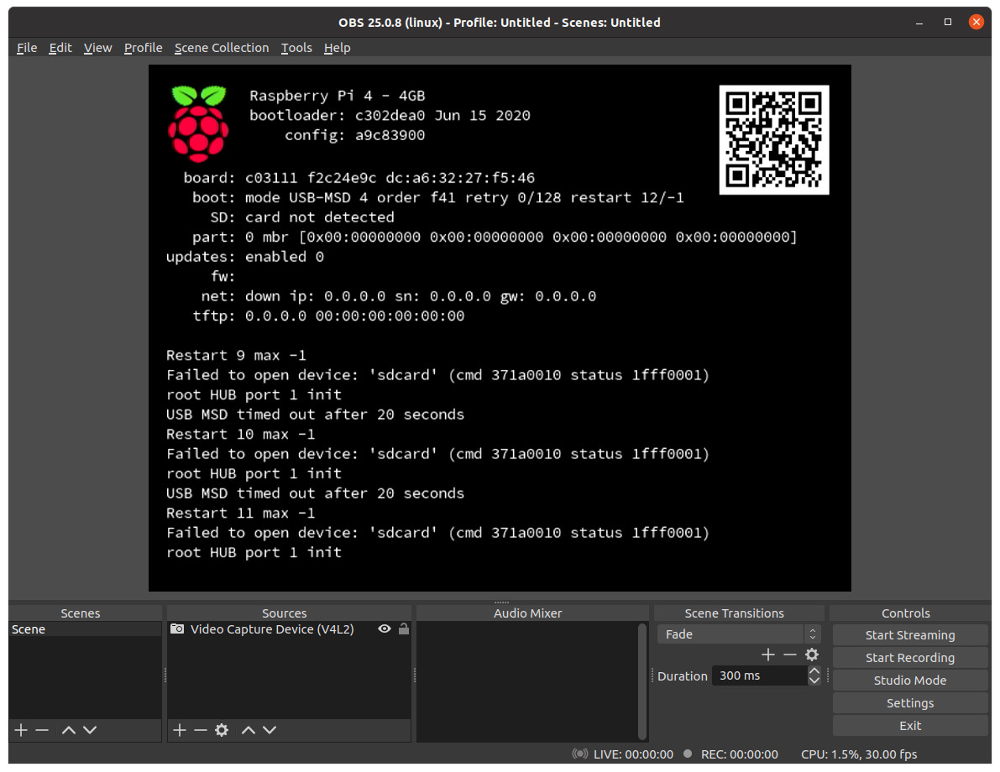
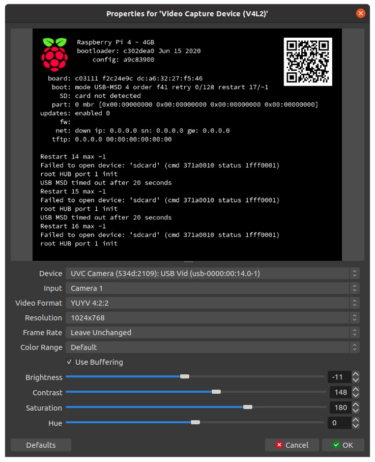

# About

This repository has information about these [cheap USB HDMI video capture dongle](https://www.amazon.es/gp/product/B088ZYW5JY/) that are available at Amazon/AliExpress/Banggood:


These are great for capturing a computer HDMI output (e.g. from a raspberry pi) into a video file.

You can use [Open Broadcaster Software (OBS) Studio](https://obsproject.com/) ([obsproject/obs-studio](https://github.com/obsproject/obs-studio)) to easily record a video from the HDMI input:



And the source properties were configured as:



**TIP** After setting the source resolution, and returning to the main window, you should right-click the video source, and execute the `Resize output (source size)` command to resize the output canvas to the size of the source.

After recording, it looks like:

[obs-recording-1024x768.mp4](obs-recording-1024x768.mp4)

## details

lsusb details:

```bash
lsusb
```
```
Bus 003 Device 004: ID 534d:2109 MACROSILICON
```

```bash
lsusb -s 3:4 -v
```

See the output at [lsusb-output.txt](lsusb-output.txt).

v4l details:

```bash
v4l2-ctl --device /dev/video0 --list-formats-ext --all
```

See the output at [v4l-output.txt](v4l-output.txt).
